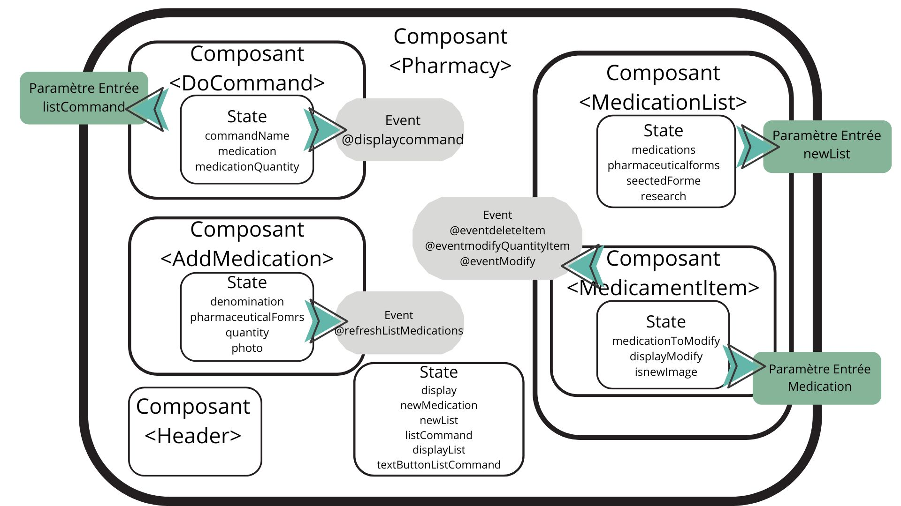

### **La Pharmacie**

L’objectif de ce mini-projet est de développer une application web (uniquement la partie front) permettant de gérer le stock de médicaments d’une pharmacie.

### **Fonctionnalités**

Les fonctionnalités :

* Afficher le contenu de la pharmacie : liste des médicaments
* Ajouter un nouveau médicament à la pharmacie
* Supprimer un médicament de la pharmacie
* Ajouter/retirer 1 à la quantité d’un médicament présent dans la pharmacie
* Modifier les infos d’un médicament présent dans la pharmacie (toutes les caractéristiques)
* Rechercher des médicaments
* Créer une commande client (en local)
* Rechercher la liste des commandes client (en local)
* Filtrer par façon de prendre le médicament
* Mode “poulailler”

### **Détails des fonctionnalités**

La pharmacie est modélisée assez simplement. Chaque médicament est dans un cadre. Dans ce dernier, nous pouvons retrouver diverses fonctionnalités : la suppression du médicament, l'incrémentation ou la décrémentation de sa quantité en stock, mais aussi le fait de le modifier. Dans cette dernière fonctionnalité, nous pouvons modifier divers attributs du médicament comme sa quantité, sa photo, sa forme pharmaceutique ou encore son nom.

Parallèlement, nous pouvons ajouter de nouveaux médicaments grâce à l'aide d'un bouton situé en bas de l'interface. Lorsque nous cliquons dessus, des champs apparaissent et nous permettent de renseigner toutes les caractéristiques d'un médicament (nom, forme pharmaceutique, quantité et image).

De plus, nous pouvons rechercher des médicaments par leur nom. Cette recherche n'a pas besoin d'être "exacte" : si nous tapons une suite de lettres comme "li", tous les médicaments comportant cette suite de lettres s'afficheront. Afin de réafficher tous les médicaments, il suffit de chercher un texte vide.

### **Fonctionnalités supplémentaires en local**

La pharmacie comporte une fonctionnalité "Commande" qui permet de créer une commande client. Cette fonctionnalité est accessible en cliquant sur un bouton en haut de la page. Lorsque le bouton est enclenché, il ouvre la possibilité de voir et remplir des champs de texte afin de caractériser une commande (nom du demandeur de la commande, nom du médicament commandé, nombre de boîtes de ce médicament). Après avoir validé, cela crée une commande.

Toutes les commandes peuvent être observées en cliquant sur le bouton à droite de celui décrit précédemment. Ce dernier affiche alors la liste des commandes créées.

### **Détail de ces deux fonctionnalités**

La fonctionnalité "commande" et "liste des commandes client" est générée en local du fait de l’API non modifiable.

### **Fonctionnalités supplémentaires**

Pour filtrer les médicaments par forme pharmaceutique, il suffit d'en sélectionner une dans le menu déroulant. Lorsque ce dernier est sélectionné, les médicaments concernés s'affichent. Afin de retrouver la liste initiale de médicaments, il suffit de re-sélectionner "Choisir une catégorie". De plus, lorsque nous ajoutons un nouveau médicament avec un nouveau type de forme pharmaceutique, la liste déroulante se met à jour.

Le mode poulailler est un mode humoristique qui permet d'afficher une petite poule dansante. Afin qu'elle disparaisse, il suffit de **re-cliquer** sur le bouton.

### **Graphe décrivant l’architecture de votre application**

